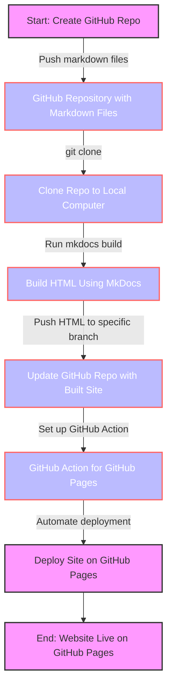

# Markdown Book

Storing Markdown Files on GitHub Repo: This involves creating a repository on GitHub and pushing your Markdown files to it.
Copying the Repo to a Computer: This step involves cloning the GitHub repository to your local computer.
Executing MkDocs Build Command: Here, you'll use MkDocs to convert the Markdown files into HTML for a website.
Pushing the Built Website to a Repo Branch: After building the HTML files, you push these back to a different branch of your GitHub repository.
GitHub Action to Serve the Site on GitHub Pages: Finally, you set up a GitHub Action in your repository that automatically deploys the website to GitHub Pages whenever the specified branch is updated.



To create a GitHub Action that builds and deploys a website whenever a commit is made to an MkDocs repository, you will need a workflow file in your repository's .github/workflows directory. This workflow will typically include the following steps:

    Trigger: The workflow should be triggered on push events, particularly to the branch where your MkDocs content is (commonly the main or master branch).

    Setup: The workflow will set up a Python environment, as MkDocs is a Python-based tool.

    Install Dependencies: Install MkDocs and any additional dependencies specified in a requirements.txt file or directly in the workflow file.

    Build the MkDocs Site: Use MkDocs to build the static site.

    Deploy: Deploy the built site. The deployment method depends on where you want to host the site. For GitHub Pages, there are Actions like peaceiris/actions-gh-pages that can be used.

Here's a basic example of a GitHub Actions workflow file for an MkDocs project. This assumes you're deploying to GitHub Pages:

```
yaml

name: Deploy MkDocs Site

on:
  push:
    branches:
      - main  # Set your default branch here

jobs:
  deploy:
    runs-on: ubuntu-latest

    steps:
    - name: Checkout
      uses: actions/checkout@v2

    - name: Set up Python
      uses: actions/setup-python@v2
      with:
        python-version: '3.x'  # Set the Python version as per your requirement

    - name: Install dependencies
      run: |
        python -m pip install --upgrade pip
        pip install mkdocs
        # If you have a requirements.txt file, uncomment the next line
        # pip install -r requirements.txt

    - name: Build the MkDocs site
      run: mkdocs build

    - name: Deploy to GitHub Pages
      uses: peaceiris/actions-gh-pages@v3
      with:
        github_token: ${{ secrets.GITHUB_TOKEN }}
        publish_dir: ./site
```
Place this file in your repository at .github/workflows/mkdocs-deploy.yml or a similar path. Make sure to adjust the branch names, Python version, and any additional dependencies as per your project's requirements.

This file sets up a workflow that is triggered on each push to the main branch, installs the necessary Python environment, builds your MkDocs site, and deploys it to GitHub Pages.

Remember, if you're deploying to a different platform or need more complex setup (like custom plugins for MkDocs), you'll need to modify the workflow accordingly.


In GitHub Actions, the on keyword is used to define the event(s) that will trigger the workflow. There are several options available, each catering to different use cases. Below are the primary events and their variations:
Workflow Trigger Events

    push: Triggers the workflow on a push event to the repository.
        You can specify branches and paths to filter when this event is triggered.

    pull_request: Triggers the workflow when a pull request is opened, synchronized, or reopened.
        Can be further customized for specific activity types (like opened, synchronize, reopened, etc.), and you can also specify branches and paths.

    schedule: Triggers the workflow at scheduled times.
        Uses POSIX cron syntax for scheduling.

    workflow_dispatch: Allows manual triggering of the workflow.
        This can be done from the GitHub UI or via the GitHub API.

    repository_dispatch: Triggers the workflow when a repository dispatch event occurs.

    release: Triggers the workflow when a release is created.
        Can be configured for different types of release events (like published, created, edited, etc.).

    workflow_run: Triggers the workflow when another workflow is run.

    issues: Triggers the workflow when an issue is opened, edited, deleted, transferred, pinned, unpinned, closed, reopened, assigned, unassigned, labeled, unlabeled, locked, unlocked, or milestoned.
        You can specify the types of activity that trigger the workflow.

    issue_comment: Triggers the workflow when an issue comment is created, edited, or deleted.

    watch: Triggers the workflow when someone stars the repository.

    fork: Triggers the workflow when the repository is forked.

    gollum: Triggers the workflow when a wiki page is created or updated.

    page_build: Triggers the workflow when a GitHub Pages site is built.

    project, project_card, project_column: Triggers the workflow for various project board activities.

    public: Triggers the workflow when the repository visibility changes to public.

    pull_request_review, pull_request_review_comment: Triggers the workflow for pull request review events.


to set up a GitHub Actions workflow for building a MkDocs documentation site and hosting it as a static page on GitHub Pages, you'll need to create a YAML workflow file in your repository. Here's a basic template for the workflow:

    Create a Workflow File: Create a file in your repository under .github/workflows/, for example, .github/workflows/mkdocs.yml.

    Workflow Content:

    yaml

    name: Deploy MkDocs Site

    on:
      push:
        branches:
          - main  # Trigger on pushes to the main branch. Adjust as needed.

    jobs:
      deploy:
        runs-on: ubuntu-latest

        steps:
        - name: Checkout
          uses: actions/checkout@v2

        - name: Set up Python
          uses: actions/setup-python@v2
          with:
            python-version: '3.x'  # Use the Python version needed for your MkDocs

        - name: Install dependencies
          run: |
            python -m pip install --upgrade pip
            pip install mkdocs  # Add other dependencies if needed

        - name: Build MkDocs site
          run: mkdocs build

        - name: Deploy to GitHub Pages
          uses: peaceiris/actions-gh-pages@v3
          with:
            github_token: ${{ secrets.GITHUB_TOKEN }}
            publish_dir: ./site  # Replace with your MkDocs build directory if different

    Explanation:
        Trigger: The workflow is triggered on push events to the main branch.
        Jobs: It defines a job called deploy that runs on an Ubuntu latest environment.
        Steps:
            Checkout: Checks out your repository under $GITHUB_WORKSPACE.
            Set up Python: Sets up a Python environment, needed for MkDocs.
            Install Dependencies: Installs MkDocs and any other necessary dependencies.
            Build MkDocs Site: Builds the static site using mkdocs build.
            Deploy to GitHub Pages: Deploys the ./site directory to GitHub Pages. This step uses the peaceiris/actions-gh-pages action, a popular action for deploying to GitHub Pages.

    Additional Configuration:
        You might need to adjust the python-version and publish_dir based on your specific MkDocs setup.
        Ensure that GitHub Pages is enabled in your repository settings and configured to use the branch that this action deploys to (usually gh-pages).

    Commit and Push: After setting up this workflow file, commit and push it to your repository. The workflow will trigger on your next push to the specified branch.

This workflow assumes a basic MkDocs setup. If you have additional dependencies or build steps, you will need to modify the workflow accordingly.
User
For the build command here:
run: mkdocs build

Can you give me a raitonal for the use of the mkdocs build instead of using the mkdocs gh-deploy command?
ChatGPT

Using mkdocs build instead of mkdocs gh-deploy in a GitHub Actions workflow can be a matter of preference and control over the deployment process. Here are some reasons to choose mkdocs build over mkdocs gh-deploy:

    Separation of Concerns: mkdocs build solely builds the static site, while mkdocs gh-deploy builds and then deploys it to GitHub Pages. By using mkdocs build, you separate the build and deployment steps. This separation can be advantageous for debugging, customizing the deployment process, and understanding the workflow.

    Custom Deployment Control: Using mkdocs build allows you to control the deployment process with a different GitHub Action, like peaceiris/actions-gh-pages. This action provides more options and flexibility, such as setting a custom deployment branch, commit messages, CNAME file for custom domains, and more.

    Consistency Across Environments: If you have multiple environments (like staging and production) or you use different hosting services for different scenarios, using mkdocs build provides a consistent approach to generate the site. You can then deploy the built site to different environments or hosts as needed.

    Workflow Clarity: By explicitly separating the build and deployment steps in your workflow, it's easier for someone reading the workflow file to understand what's happening at each stage. This clarity can be beneficial for teams and open-source projects.

    Error Handling: By separating the steps, you can add custom error handling or notifications for the build and deployment processes independently. This can be important in complex workflows where different actions might be required if either step fails.

    Caching and Performance: In some cases, separating the build and deployment steps can allow for more efficient caching strategies, potentially speeding up your CI/CD pipeline.

In summary, while mkdocs gh-deploy is a convenient command for simple use cases, using mkdocs build followed by a separate deployment step in a GitHub Actions workflow can provide more control, flexibility, and clarity, especially in more complex or customized deployment scenarios.
