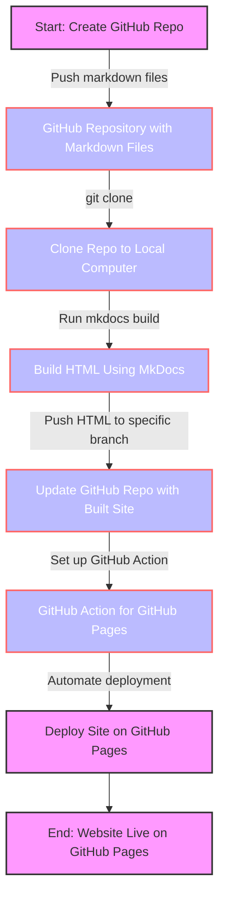

# Markdown Book

Storing Markdown Files on GitHub Repo: This involves creating a repository on GitHub and pushing your Markdown files to it.
Copying the Repo to a Computer: This step involves cloning the GitHub repository to your local computer.
Executing MkDocs Build Command: Here, you'll use MkDocs to convert the Markdown files into HTML for a website.
Pushing the Built Website to a Repo Branch: After building the HTML files, you push these back to a different branch of your GitHub repository.
GitHub Action to Serve the Site on GitHub Pages: Finally, you set up a GitHub Action in your repository that automatically deploys the website to GitHub Pages whenever the specified branch is updated.

